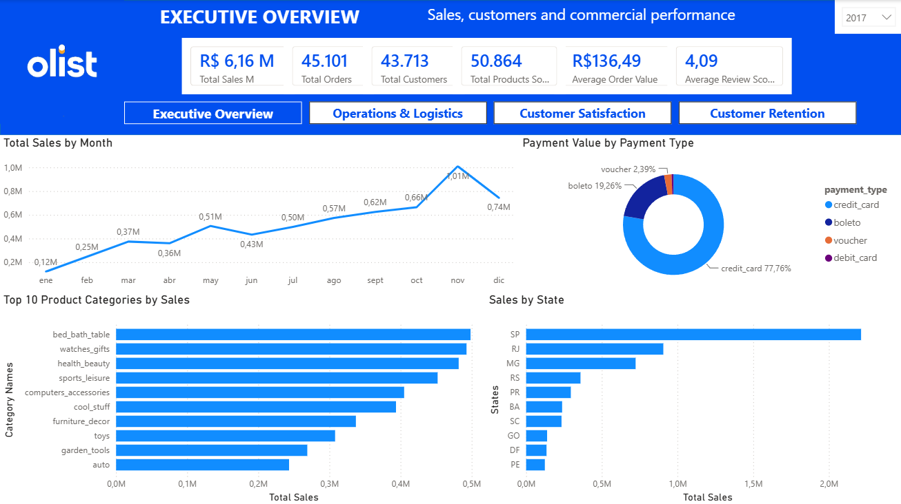
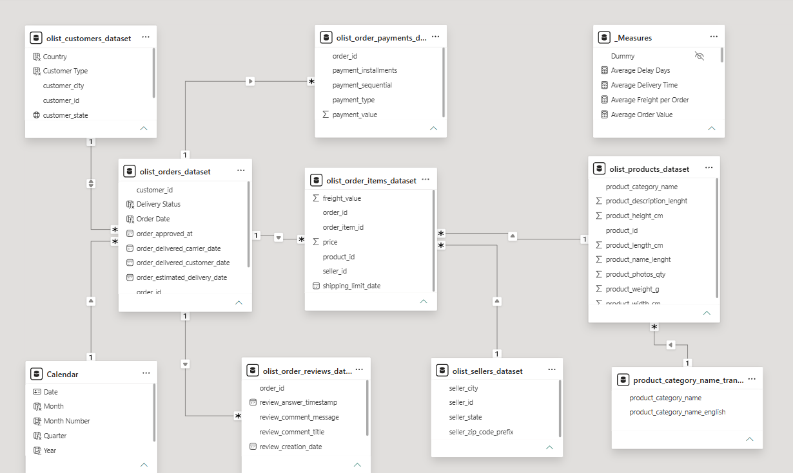
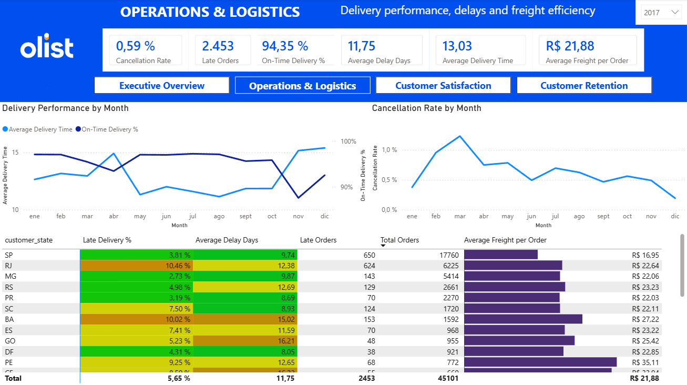
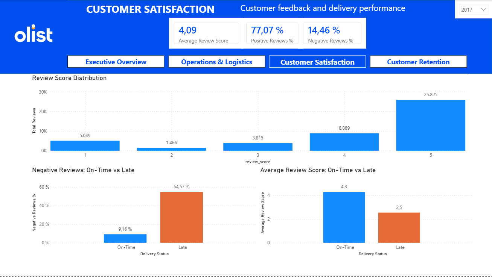
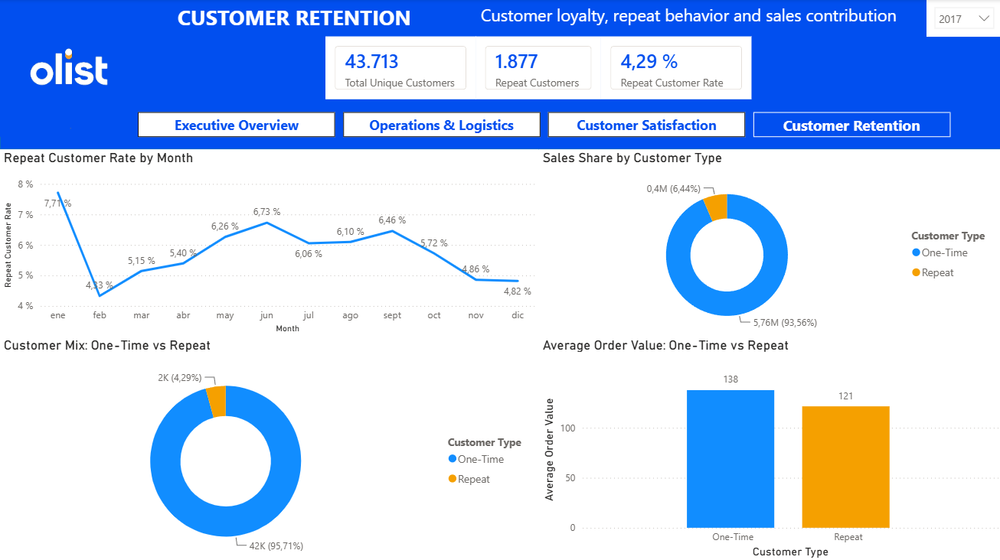
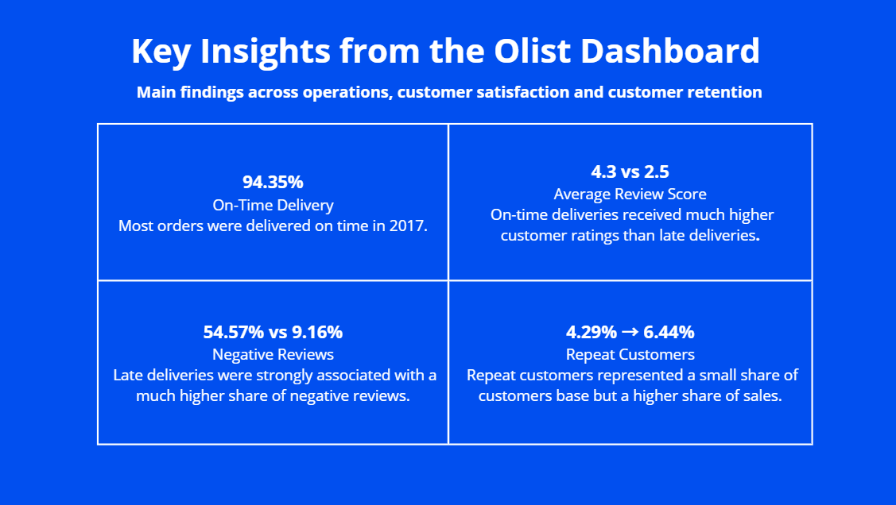

# Olist E-commerce Power BI Dashboard

Power BI project analyzing sales, logistics, customer satisfaction and customer retention using the Olist Brazilian e-commerce dataset.

## Project Overview

This project analyzes the Olist Brazilian e-commerce dataset using Power BI.

The main goal was to understand the overall performance of the business and explore how sales, logistics, customer satisfaction and customer retention are connected.

The project covers the full Power BI workflow, including data preparation, data modelling, DAX measures, business analysis and dashboard design.

## Business Questions

The dashboard was designed to answer four main questions:

- How is the business performing in terms of sales, orders and customers?
- How efficient is the delivery and logistics process?
- How is delivery performance associated with customer satisfaction?
- How important are repeat customers for the business?

## Tools & Skills

- Power BI
- Power Query
- DAX
- Data Modelling
- Data Visualization
- Business Analysis

## Data Model

The dataset contains several related tables, including customers, orders, order items, payments, reviews, products and sellers.

A Calendar table was also created to support time-based analysis and year filtering.

## Dashboard Pages

### 1. Executive Overview

Provides a general view of:

- Total sales
- Orders
- Customers
- Products sold
- Average order value
- Average review score
- Sales trends
- Product categories
- States
- Payment methods

### 2. Operations & Logistics

Focuses on:

- On-time delivery
- Average delivery time
- Late orders
- Average delay
- Cancellation rate
- Freight cost
- Operational performance by state

### 3. Customer Satisfaction

Analyzes:

- Average review score
- Positive and negative reviews
- Review score distribution
- On-time vs late delivery performance
- Negative review rate by delivery status

### 4. Customer Retention

Explores:

- Total unique customers
- Repeat customers
- Repeat customer rate
- One-time vs repeat customer mix
- Sales share by customer type
- Average order value by customer type

## Key Insights

- In the 2017 view, most orders were delivered on time.
- Late deliveries were strongly associated with lower customer satisfaction.
- On-time deliveries had an average review score of around **4.3**, compared with around **2.5** for late deliveries.
- Negative reviews were much more common for late deliveries: around **54.6%** compared with **9.2%** for on-time deliveries.
- Repeat customers represented only **4.29%** of customers in the 2017 view, but accounted for **6.44%** of sales.

## What I Learned

This project helped me understand the complete process of building a Power BI analysis, from preparing and connecting the data to creating measures and designing the final dashboard.

It also reinforced the importance of keeping dashboards clear and focused. Instead of adding more measures or visuals, I focused on the information that directly answered the business questions.

## Data Source

Brazilian E-Commerce Public Dataset by Olist  
Kaggle: https://www.kaggle.com/olistbr/brazilian-ecommerce

## Portfolio Version

A visual presentation of this project is also available on my Maven Analytics portfolio:

**Maven Analytics:**  
_Add your project link here_

## Power BI File

The `.pbix` file is approximately 60 MB and will be available separately through a GitHub Release.
